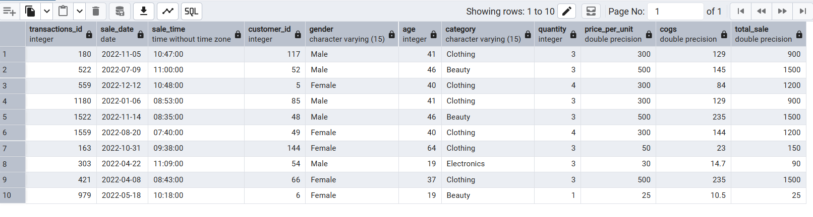
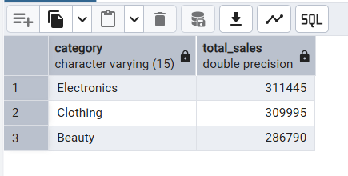
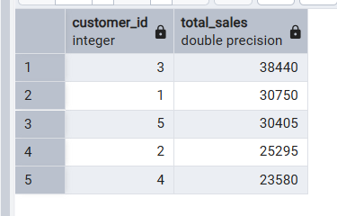
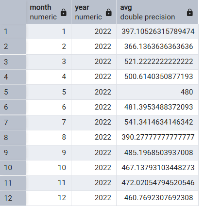
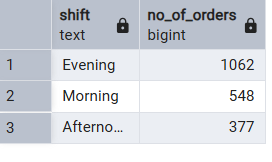

# 🛒 Retail Sales Analysis using PostgreSQL

<div align="center">

# 📊 SQL Data Analytics Project


A beginner-friendly SQL project that demonstrates **database creation, data cleaning, exploratory data analysis (EDA), and business insights** using PostgreSQL.

</div>

---

# 📌 Project Overview

This project analyzes retail sales data using **PostgreSQL**. It demonstrates fundamental SQL skills required for Data Analyst roles by creating a database, cleaning data, and solving business-related questions.

---

# 🎯 Project Objectives

* Create a retail sales database
* Import retail sales data into PostgreSQL
* Clean missing or invalid records
* Perform exploratory data analysis (EDA)
* Solve business problems using SQL queries
* Generate meaningful business insights

---

# 🛠 Technologies Used

| Tool       | Purpose             |
| ---------- | ------------------- |
| PostgreSQL | Database            |
| SQL        | Query Language      |
| pgAdmin 4  | Database Management |

---

# 📂 Project Structure

```text
Retail_sales_analysis/
│
├── README.md
├── database_setup.sql
├── data_cleaning.sql
├── analysis_queries.sql
├── retail_sales.csv
└── screenshots/
    ├── table_preview.png
    ├── sales_by_category.png
    ├── top_customers.png
    ├── monthly_sales.png
    └── shift_analysis.png
```

---

# 📊 Dataset Information

The dataset contains **2,000 retail sales transactions** with the following attributes:

| Column                    |
| ------------------------- |
| Transaction ID            |
| Sale Date                 |
| Sale Time                 |
| Customer ID               |
| Gender                    |
| Age                       |
| Product Category          |
| Quantity                  |
| Price Per Unit            |
| Cost of Goods Sold (COGS) |
| Total Sale                |

---

# 🧹 Data Cleaning

The following cleaning steps were performed:

* Checked for NULL values in all columns.
* Removed incomplete records from the dataset.
* Verified the cleaned data before analysis.

---

# 🔍 SQL Concepts Used

* CREATE TABLE
* ALTER TABLE
* SELECT
* WHERE
* GROUP BY
* ORDER BY
* DISTINCT
* Aggregate Functions (`COUNT`, `SUM`, `AVG`)
* CASE Statement
* EXTRACT Function
* LIMIT

---

# 📈 Business Questions Solved

1. Retrieve all sales made on a specific date.
2. Find Clothing sales where quantity is greater than 4 during November 2022.
3. Calculate total sales for each product category.
4. Find the average age of customers who purchased Beauty products.
5. Retrieve transactions where total sales exceed 1000.
6. Count transactions by gender within each category.
7. Calculate the average monthly sales.
8. Identify the Top 5 customers based on total sales.
9. Count unique customers for each product category.
10. Classify orders into Morning, Afternoon, and Evening shifts.

---

# 📸 Project Screenshots

## 📋 Dataset Preview



---

## 💰 Total Sales by Category



---

## 🏆 Top 5 Customers



---

## 📅 Monthly Sales Analysis



---

## 🌅 Shift Analysis



---

# 📊 Key Insights

* Successfully cleaned the dataset by removing records with missing values.
* Calculated total revenue generated by each product category.
* Identified customers with the highest overall spending.
* Analyzed monthly average sales to understand sales trends.
* Categorized transactions into Morning, Afternoon, and Evening shifts for operational insights.

---

# 🚀 How to Run the Project

### Step 1: Create the Database

Run the SQL statements in:

```text
database_setup.sql
```

### Step 2: Import the Dataset

Import the file:

```text
retail_sales.csv
```

into the `retail_sales` table using pgAdmin's Import feature.

### Step 3: Clean the Data

Execute:

```text
data_cleaning.sql
```

### Step 4: Perform Data Analysis

Execute:

```text
analysis_queries.sql
```

---

# 📚 Skills Demonstrated

* SQL Query Writing
* PostgreSQL
* Data Cleaning
* Exploratory Data Analysis (EDA)
* Aggregate Functions
* Business Reporting
* Data Analysis

---

# 📌 Future Improvements

* Add JOIN queries using multiple tables.
* Learn and implement Window Functions.
* Learn Common Table Expressions (CTEs).
* Build an interactive Power BI dashboard.
* Visualize results using Tableau.

---

#  Author

**Vasanthi**

🎓 B.Tech Computer Science Student

📊 Aspiring Data Analyst

💻 Skills: SQL | PostgreSQL | Python | Excel

---

⭐ **If you found this project helpful, consider giving it a Star!**
